# Current UI Wireframe

> Mermaid flowchart of the current app UI flow, derived from source code analysis (2026-03-27, updated after UX cleanup).

```mermaid
flowchart TB
    subgraph NAV["Top Navigation Bar"]
        direction LR
        N1[Discover]
        N2[Rate]
        N3[Watchlist]
        N4[Statistics]
        N5[Settings]
    end

    subgraph DISCOVER["Discover Page"]
        direction TB
        DS[Sidebar Filters<br>Genre · Year · Runtime<br>Rating · Min Votes<br>Certification · Keywords]
        DSORT[Sort: Personalized / Popularity / Rating / Release date]
        DMOOD[Mood Pills: Happy · Interested · Surprised · Sad · Disgusted · Afraid · Angry]
        DGRID[Poster Grid — 5 columns, clickable]
        DMORE[Load More button]
        DDLG["Detail Dialog (large)<br>Two-column: metadata + cast photos<br>Trailer embed<br>Buttons: Not interested · Add to watchlist<br>Expandable reviews"]
    end

    subgraph RATE["Rate Page"]
        direction TB
        RSRCH[Search Bar — TMDB title search]
        RSUB["Subheader: Based on your interests / Discover movies"]
        RGRID[Poster Grid — 5 columns, clickable<br>discover/movie + ML re-ranking]
        RMORE[Load More button]
        RDLG["Rating Dialog (small)<br>Slider 0-100 · Sentiment label<br>7 Mood reaction pills<br>Save button"]
    end

    subgraph WATCHLIST["Watchlist Page"]
        direction TB
        WGRID[Poster Grid — 5 columns, clickable]
        WDLG["Detail Dialog (large)<br>Streaming logos · Runtime<br>Trailer embed · Watch Now link<br>Buttons: Remove · Mark as watched<br>Rating widget on Mark as watched"]
    end

    subgraph STATISTICS["Statistics Page"]
        direction TB
        SKPI["KPIs: Movies rated · Watch hours · Avg rating · Watchlisted"]
        SGENRE[Genre Preferences — bar chart, colored by avg rating]
        SMOOD[Mood Profile — horizontal bar chart with emojis]
        SVSTMDB[You vs TMDB — scatter + trend + diagonal]
        SRANK["Favorite Directors + Actors — photos, count, avg rating"]
        STABLE[Your Ratings — sortable table with progress bars]
    end

    subgraph SETTINGS["Settings Page"]
        direction TB
        SETC[Streaming Country — dropdown, auto-save]
        SETS[Subscriptions — provider logo grid with checkmarks, auto-save]
        SETL[Preferred Language — dropdown, auto-save]
        SETR[Reset to Factory Settings button]
    end

    %% Navigation flow
    N1 --> DISCOVER
    N2 --> RATE
    N3 --> WATCHLIST
    N4 --> STATISTICS
    N5 --> SETTINGS

    %% Data flow between pages
    DDLG -- "Add to watchlist" --> WGRID
    DDLG -- "Not interested" --> DGRID
    RDLG -- "Save rating" --> STABLE
    WDLG -- "Mark as watched" --> STABLE
    WDLG -- "Remove" --> WGRID

    %% Settings influence
    SETTINGS -. "country, providers,<br>language preferences" .-> DISCOVER

    %% ML scoring flow
    RDLG -- "ratings + moods" --> RGRID
    RDLG -- "ratings + moods" --> DGRID
```

## Page Summary

| Page | Layout | Key Elements | Data Source |
|------|--------|-------------|-------------|
| Discover | Sidebar + main | 8 filters, mood pills, sort dropdown, poster grid, detail dialog | TMDB API + ML scoring |
| Rate | Single column | Search bar, poster grid, rating dialog (slider + moods) | TMDB API + ML scoring |
| Watchlist | Single column | Poster grid, detail dialog (streaming, trailer, rating) | SQLite + TMDB API |
| Statistics | Single column | KPIs, 4 charts, rankings, rated movies table | SQLite only |
| Settings | Single column | Country dropdown, provider grid, language dropdown, reset | SQLite + TMDB API |
