# Wireframes

---

## Current UI Wireframe

> Mermaid flowchart of the current app UI flow, derived from source code analysis (2026-03-27, updated 2026-03-27: Discover more button on Watchlist).

```mermaid
flowchart TB
    subgraph NAV["Top Navigation Bar"]
        direction LR
        N1[Discover]
        N2[Rate]
        N3[Watchlist]
        N4[Statistics]
        N5[Settings]
    end

    subgraph DISCOVER["Discover Page"]
        direction TB
        DS[Sidebar Filters<br>Genre · Year · Runtime<br>Rating · Min Votes<br>Certification · Keywords]
        DSORT[Sort: Personalized / Popularity / Rating / Release date]
        DMOOD[Mood Pills: Happy · Interested · Surprised · Sad · Disgusted · Afraid · Angry]
        DGRID[Poster Grid — 5 columns, clickable]
        DMORE[Load More button]
        DDLG["Detail Dialog (large)<br>Two-column: metadata + cast photos<br>Trailer embed<br>Buttons: Not interested · Add to watchlist<br>Expandable reviews"]
    end

    subgraph RATE["Rate Page"]
        direction TB
        RSRCH[Search Bar — TMDB title search]
        RSUB["Subheader: Based on your interests / Discover movies"]
        RGRID[Poster Grid — 5 columns, clickable<br>discover/movie + ML re-ranking]
        RMORE[Load More button]
        RDLG["Rating Dialog (small)<br>Slider 0-100 · Sentiment label<br>7 Mood reaction pills<br>Save button"]
    end

    subgraph WATCHLIST["Watchlist Page"]
        direction TB
        WGRID[Poster Grid — 5 columns, clickable]
        WDISC["Discover more button — navigates to Discover page"]
        WDLG["Detail Dialog (large)<br>Streaming logos · Runtime<br>Trailer embed · Watch Now link<br>Buttons: Remove · Mark as watched<br>Rating widget on Mark as watched"]
    end

    subgraph STATISTICS["Statistics Page"]
        direction TB
        SKPI["KPIs: Movies rated · Watch hours · Avg rating · Watchlisted"]
        SGENRE[Genre Preferences — bar chart, colored by avg rating]
        SMOOD[Mood Profile — horizontal bar chart with emojis]
        SVSTMDB[You vs TMDB — scatter + trend + diagonal]
        SRANK["Favorite Directors + Actors — photos, count, avg rating"]
        STABLE[Your Ratings — sortable table with progress bars]
    end

    subgraph SETTINGS["Settings Page"]
        direction TB
        SETC[Streaming Country — dropdown, auto-save]
        SETS[Subscriptions — provider logo grid with checkmarks, auto-save]
        SETL[Preferred Language — dropdown, auto-save]
        SETR[Reset to Factory Settings button]
    end

    %% Navigation flow
    N1 --> DISCOVER
    N2 --> RATE
    N3 --> WATCHLIST
    N4 --> STATISTICS
    N5 --> SETTINGS

    %% Data flow between pages
    DDLG -- "Add to watchlist" --> WGRID
    DDLG -- "Not interested" --> DGRID
    RDLG -- "Save rating" --> STABLE
    WDLG -- "Mark as watched" --> STABLE
    WDLG -- "Remove" --> WGRID
    WDISC -- "switch_page" --> DISCOVER

    %% Settings influence
    SETTINGS -. "country, providers,<br>language preferences" .-> DISCOVER

    %% ML scoring flow
    RDLG -- "ratings + moods" --> RGRID
    RDLG -- "ratings + moods" --> DGRID
```

---

## Page Summary

| Page | Layout | Key Elements | Data Source |
|------|--------|-------------|-------------|
| Discover | Sidebar + main | 8 filters, mood pills, sort dropdown, poster grid, detail dialog | TMDB API + ML scoring |
| Rate | Single column | Search bar, poster grid, rating dialog (slider + moods) | TMDB API + ML scoring |
| Watchlist | Single column | Poster grid, Discover more button, detail dialog (streaming, trailer, rating) | SQLite + TMDB API |
| Statistics | Single column | KPIs, 4 charts, rankings, rated movies table | SQLite only |
| Settings | Single column | Country dropdown, provider grid, language dropdown, reset | SQLite + TMDB API |

---

## Comparison: Original Concept vs Current Implementation

> Compares the original project concept (from `docs/concept.md` and team brainstorming) with the final implementation state (2026-03-27).

---

### Feature Comparison

| Feature | Original Concept | Current Implementation | Status |
|---------|-----------------|----------------------|--------|
| **Problem statement** | "Avoid aimless scrolling across streaming platforms" | Personalized movie discovery with ML-based ranking | Adopted |
| **Data source** | TMDB API (free, widely used) | TMDB API v3 + offline tmdb.sqlite (1.17M movies) | Expanded |
| **Tag/genre selection** | "Choose which tags to propose on the app" | 19 TMDB genres as multi-select pills in sidebar | Adopted |
| **Movie matching** | "Match tags entered by users to a movie from the database" | TMDB `discover/movie` API with 8 filter parameters | Expanded |
| **Ranking (cold start)** | "Recommend movies from best to worse TMDB rating" | Popularity-based ordering via TMDB API sort | Adopted |
| **Ranking (personalized)** | Not specified in concept | 11-signal cosine similarity scoring with dynamic weights | New |
| **Already-watched exclusion** | "Remove it from possible recommendations" | Rated + dismissed + watchlisted movies excluded from browse grids | Adopted |
| **Rating system** | "User can give a rating to the movie/series" | 0-100 slider (steps of 10) with color-coded track and sentiment labels | Expanded |
| **Not interested button** | "Replaces the recommendation by another" | "Not interested" dismisses movie and caches details for ML | Adopted |
| **User stats (Spotify Wrapped)** | "How many movies featuring X director or Y actor — accessible anytime" | KPIs, 4 Altair charts, top 5 directors/actors with photos, sortable table | Expanded |
| **Machine learning** | "Can be implemented to support the recommendation system" | Offline pipeline (TF-IDF/SVD, emotion classifier) + online scoring (11 signals) | Expanded |
| **Mood reactions** | Not in original concept | 7 Ekman mood buttons on every rating dialog | New |
| **Watchlist** | Not in original concept | Dedicated page with streaming providers, trailer, Watch Now link | New |
| **Settings page** | Not in original concept | Streaming country, subscriptions, preferred language | New |
| **Keyword search** | Mentioned as "tags" | TMDB keyword autocomplete with removable chips in sidebar | Adopted |
| **Certification filter** | Not in original concept | Age certification dropdown (DE) in sidebar | New |
| **Streaming providers** | Mentioned as "across all streaming platforms" | Provider logos in dialogs + subscription management in Settings | Expanded |
| **Mood filter (Discover)** | Not in original concept | 7 mood pills filtering against precomputed mood_scores.npy | New |
| **Series support** | "Movie/series recommender" | Movies only (series excluded) | Changed |
| **Design/theme** | "Leaving out design stuff for later" | Cinema Gold theme (dark, copper/gold accent, Poppins font) | New |
| **Multi-page navigation** | Not specified | 5 top-navigation tabs (Discover, Rate, Watchlist, Statistics, Settings) | New |

---

### Summary

| Status | Count | Description |
|--------|-------|-------------|
| Adopted | 6 | Original concept features implemented as described |
| Expanded | 5 | Original ideas implemented with significantly more depth |
| New | 8 | Features not in the original concept |
| Changed | 1 | Series support dropped (movies only) |

The final app goes well beyond the original concept in every dimension: data infrastructure (1.17M movie database vs live API only), ML sophistication (11-signal scoring vs simple tag matching), user interaction (mood reactions, watchlist, settings), and visualization (4 chart types, KPIs, rankings vs basic stats).
